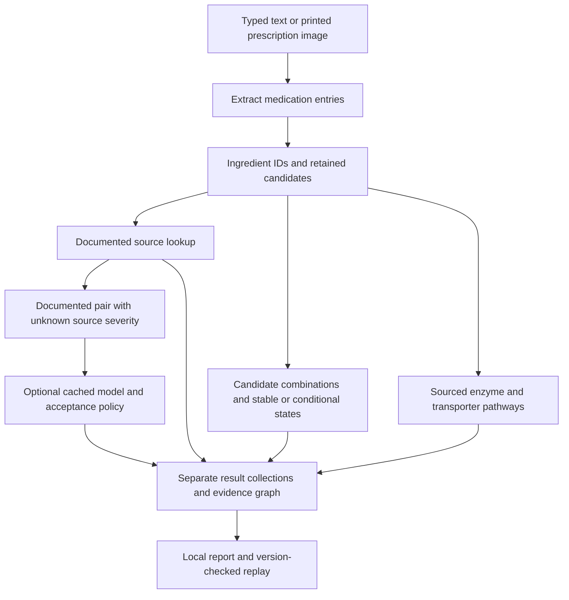

**Explaining the hybrid medication interaction project — teacher and teammate preparation**

Prepared for the local research release of 5 October 2026. The results below describe executed software and source-label experiments. They do not establish patient-specific risk, clinical effectiveness, or previously unreported algorithmic novelty.

Start your explanation with this:

> We built a local medication interaction research prototype that accepts prescription text or printed images. It maps medicines to ingredient IDs, retrieves documented interactions, and carries uncertain medicine identities through screening instead of silently guessing one identity. A separate sourced biological layer shows compatible enzyme and transporter pathways. We also trained and compared molecular and graph models to predict high, moderate, or low source severity for documented interactions. We evaluated unseen drugs, missing features, recognition errors, explanation quality and calibration. Molecular/network fusion improved held-out pair classification, but generalization and deployment acceptance remain limited. The application keeps documented findings, conditional findings, biological possibilities and model outputs separate.

**The problem has four distinct parts.** A prescription reading can be wrong; the ingredient identity can be ambiguous; a source record can be absent or lack severity; and a learned model can be wrong or overconfident. These are different uncertainties. Combining them into one confident-looking alert would conceal information the user needs. Our architecture preserves those distinctions and makes their consequences measurable.

The project has two workflows. Dataset preparation, training, calibration and explanation experiments happen offline. Prescription processing loads existing local sources and, optionally, a cached trained checkpoint. Opening the application does not start training.

The application processes an input as follows:

1. Typed text enters directly; an English printed prescription image goes through local PaddleOCR. The adapter retains text, recognition scores and regions. Handwritten prescriptions and arbitrary clinical photographs are not validated capabilities.
2. Parsing extracts medication entries and preserves original text and available strength, route and frequency fields. Dose information is retained for inspection; it is not used by the learned severity classifier.
3. Terminology matching maps recognized names and configured aliases to stable ingredient IDs. Uncertain entries retain up to five lexical candidate ingredient sets. Similarity scores are not calibrated identity probabilities.
4. Resolved ingredients are checked against the local DDInter snapshot and configured supplementary records/rules. A documented label stays authoritative. Unknown source severity, no source record and unusable identity remain different states.
5. Candidate propagation checks all retained combinations for each entry pair and relevant internal combination-product pairs. It records the ingredient IDs and source states behind each possibility. Cached pair joins avoid enumerating every interpretation of the whole prescription.
6. Directed biological queries join documented inhibitor/inducer roles to documented substrate roles for matching target labels. Source conditions, strength categories and provenance accompany the paths. The paths do not assign clinical pair severity.
7. When the local research-model option is enabled, only eligible documented pairs with unknown source severity enter application inference. Artifact compatibility, molecular coverage, covered training identities and the calibrated acceptance policy are checked. The selected deployment currently abstains on all model decisions.
8. The application displays documented findings, candidate-dependent assessments, mechanism-supported possibilities and model predictions/abstentions separately. Optional Groq explanations receive allowlisted source-backed records only. Reports include version/hash information; replay requires matching software, sources and applicable model artifacts.

For a hypothetical uncertain entry, suppose candidates A and B are paired with resolved medicine C. If A–C has a high source label and B–C has no record, the high finding is conditional on A being the correct identity. If all retained interpretations have a high label, the severity predicate is stable within that candidate set, even if the underlying records differ. Neither result proves the true prescribed identity is included. This distinction is central to the uncertainty engine.

The earlier application already had OCR, source lookup, evidence tracking and optional identity correction/review. The hybrid upgrade added automatic candidate conclusions, sourced biological-role queries, trained severity comparisons, model acceptance/abstention, evaluated model rationale, and broader reproducible experiments. Do not describe every earlier feature as newly invented.

| Decision | Why we chose it | What we cannot infer from that choice |
| --- | --- | --- |
| Stable ingredient IDs | Join synonyms, source pairs, molecules and biological facts consistently. | A successful name match does not prove the image was read correctly. |
| Lexical candidates, initially limited to five | A bounded, inspectable method using the existing terminology; keeps pair enumeration practical. | Five is not proven optimal; candidate inclusion is not probabilistic coverage. |
| Exact pair candidate joins | Preserve conditional outcomes without choosing identities based on interaction severity. | Showing every potential record is not proven to improve user decisions. |
| PubChem mapping plus identity checks | Retrieve structures programmatically and preserve CID/InChIKey/provenance; reject mapping conflicts. | Chemical identity information is not interaction evidence. |
| Morgan fingerprints, radius 2 and 2,048 bits | Fixed-size, deterministic structural features suitable for a compact CPU baseline. | They are incomplete, hashed structural summaries; settings are not proven optimal. |
| Fingerprint MLP baseline | Test how much classification is possible from molecular information alone. | A neural baseline is not a comparison against every conventional classifier. |
| Two mean-GraphSAGE layers | Learn a shared neighbor-aggregation function from drug features and training-network context. | Inductive architecture does not guarantee good unseen-drug performance. |
| Molecular/network fusion | Test whether the two information sources complement one another. | Complexity alone does not prove a useful improvement. |
| Biological-role ablation | Test whether documented roles add information beyond molecular/network features. | Sparse role coverage does not support a broad mechanistic prediction claim. |
| Symmetric pair features | Sum, absolute difference and product give order-invariant pair classification. | Biological effects themselves are not necessarily symmetric; mechanism paths remain directed. |
| Temperature scaling | Adjust probability sharpness using held-out labeled data with one scalar parameter. | It does not repair misclassifications or validate unknown-label deployment. |
| Calibration acceptance policy | Separate raw predictions from outputs that meet a defined experimental acceptance criterion. | The 10% criterion is not a clinical standard or formal distribution-free guarantee. |
| SHAP and GNNExplainer | Inspect influential inputs using methods appropriate for the baseline and graph models. | Attributions are not proof of biological causation. |
| CPU inference and optional dependencies | Keep source screening usable without ML libraries, paid APIs or model artifacts. | Cloud/GPU and container execution have not been demonstrated locally. |

These are engineering/research choices, not claims that the chosen methods are universally best. Morgan fingerprints and their radius/bit settings are documented by [RDKit](https://www.rdkit.org/docs/GettingStartedInPython.html#morgan-fingerprints-circular-fingerprints). The [GraphSAGE paper](https://proceedings.neurips.cc/paper/2017/hash/5dd9db5e033da9c6fb5ba83c7a7ebea9-Abstract.html) defines learning through neighborhood feature aggregation. [PubChem PUG-REST](https://pubchem.ncbi.nlm.nih.gov/docs/pug-rest) provides programmatic chemical-data access. Our selection emphasizes an inspectable comparison that can run locally; broader architecture tuning remains future work.

Offline preparation uses the local source snapshot with 1,939 drug identities and 160,235 unique unordered source pairs. Supervised learning uses only mapped pairs with known high/moderate/low labels. The frozen learning cohort has 1,107 identity-verified molecules and 53,779 pairs: 11,435 high, 39,861 moderate and 2,483 low. Unknown labels are excluded from supervision; absent records never become negative/safe examples.

The later full molecular retrieval attempted all 1,939 identities, with 1,337 mapped and 602 exclusions. It remains a separate snapshot. Changing the mapping cohort halfway through model comparisons would change the dataset and undermine comparability.

We trained four models under two fixed protocols and three seeds: 4 × 2 × 3 = 24 corrected experiments. Pair holdout measures new combinations within a largely familiar drug population. Drug holdout measures one-unseen and both-unseen drug conditions. Identical full InChIKeys share a drug partition. Within each protocol, training pairs are divided into message-passing edges and separate supervision pairs; supervision, validation, calibration and test query pairs, including reversed copies, are excluded from adjacency.

| Model | Pair macro-F1, mean ± sample SD | One-unseen macro-F1 | Both-unseen macro-F1 |
| --- | --- | --- | --- |
| Fingerprint MLP | 0.7888 ± 0.0116 | 0.5778 | 0.3856 |
| GraphSAGE | 0.7919 ± 0.0088 | 0.5394 | 0.4040 |
| Molecular/network fusion | 0.8170 ± 0.0050 | 0.5560 | 0.3751 |
| Fusion with documented roles | 0.8178 ± 0.0098 | 0.5512 | 0.3815 |

Fusion improves held-pair macro-F1 by about 0.0282 over the molecular baseline. These are macro-F1 values, not clinical accuracy percentages. The role increment is small; only 28 learning-cohort drugs have documented roles. The fingerprint baseline is strongest for one-unseen drugs, and GraphSAGE is strongest among these four for both-unseen drugs. Our fusion hypothesis therefore has support for held-pair interpolation, not for general superiority.

Architecture selection used mean validation macro-F1 across seeds, with a representative seed near the winning architecture's validation mean. It selected pair-protocol role fusion, seed 29. That checkpoint's individual pair-test macro-F1 is 0.82857. Its proposed acceptance policy produced 122 mistakes among 1,304 accepted independent-check cases: observed error about 9.36%, but Wilson upper error 11.058%, above the 10% criterion. Consequently its deployed threshold is null and application decisions abstain.

The active archived `model_corrected/cold/role_fusion/29/calibration.json` is a different research checkpoint. It has a threshold around 0.94135, and its independent check has 13 errors among 227 accepted cases with upper error about 9.55%. This does not change the selected pair-protocol deployment. Thresholds belong to specific weights, protocol and calibration data; they cannot be copied across models. The current application gate also rejects cold-protocol checkpoints for application acceptance.

The following questions cover the main teacher/team discussion. Answers are phrased so you can adapt them directly.

1. **What exactly does the project predict?**

   The learned component predicts the high, moderate or low severity annotation of an already documented interaction pair. It does not predict whether an interaction exists, discover a previously unknown DDI, or estimate whether a particular patient will suffer an adverse reaction. The application's source engine retrieves documented records separately. This narrower target gives us labeled examples and a defensible evaluation task.

2. **Why is this project needed if interaction databases already exist?**

   The database is an essential input, not something we replace. Our prototype investigates the processing around it: translating noisy medicine text into identities, preserving ambiguity through pair screening, exposing missing information, tracing biological sources, and evaluating conditional-severity models. A database alone does not validate those choices for our input pipeline. Existing products may already address parts of this problem; we do not claim the workflow is unprecedented or clinically superior to them.

3. **Why use ML when a database can return severity immediately?**

   For a record with known severity, we use its source label. ML is a research experiment for severity completion and generalization, with possible application use only for unknown-severity documented records. Training on known labels lets us hide labels and score predictions. It does not prove performance on genuinely unknown records, because their distribution may differ and independent target labels are unavailable. Current accepted deployment utility is therefore unproven.

4. **Is this just a chatbot or an API wrapper?**

   The core consists of deterministic parsing/identity joins, source screening, exact candidate propagation, directed sourced role queries, a locally trained classifier, acceptance checks and versioned outputs. It works without Groq. The optional language model helps present allowlisted source excerpts; it does not decide medicine identity, severity or novel biological relationships. The project also contains executed training, perturbation and explanation experiments rather than only external API calls.

5. **What is our USP or contribution?**

   The defensible contribution is the implemented, evaluated combination of uncertainty-preserving prescription screening, source-authoritative outputs, molecular/network severity comparisons and explicit acceptance/abstention. A possible paper contribution is its experimental analysis across pair/drug holdouts, missing modalities and recognition conditions. GraphSAGE, SHAP, fusion and temperature scaling are established methods. A claim of novel algorithms or priority requires a fuller related-work comparison; we have not established one.

6. **Does the architecture actually make sense?**

   Yes as a research prototype: each layer addresses a different gap, and its value is tested instead of assumed. Source lookup handles known annotations, candidate joins handle identity ambiguity, sourced paths expose documented role relationships, and learned models investigate conditional severity. Results also tell us which ideas lack demonstrated benefit. More features are not automatically more useful; the biological ablation and candidate burden must remain visible.

7. **Why preserve several identities instead of taking the best match?**

   Automatically accepting the best lexical match can hide identity uncertainty. Retaining alternatives lets us distinguish conclusions that change with identity from those shared across retained candidates. However, the top-1 baseline performs strongly on our generated corruptions, and exhaustive potential records create substantial burden. Candidate propagation is an uncertainty representation; these experiments do not establish it as the better automatic decision policy.

8. **What does stable mean? Can a stable conclusion still be wrong?**

   Stable means a predicate holds for every retained interpretation, not every possible real-world identity. If the correct ingredient is absent, the stable predicate can be wrong. Our held-out text experiment recorded 11 incorrect stable predicates out of 883, about 1.25%. Also, two different candidate pairs can have the same severity but different source records. We preserve stable severity and stable exact record IDs separately.

9. **Why five candidates? What is the computational cost?**

   Five is a bounded initial choice inherited from the candidate generator, not an optimized scientific result. Two entries with five single-ingredient candidates produce up to 25 candidate interpretations. With n entries and k candidates, entry-pair enumeration is approximately O(n²k²), with extra ingredient checks for combination products. Full prescription enumeration would grow as k^n. We use pair joins and caches; future candidate-limit comparisons should measure true-identity coverage, latency and alert burden together.

10. **Could interaction results be used to guess the medicine?**

    We deliberately do not choose the identity that produces the most alerts or the most severe alert. That would make identity resolution depend on the outcome we are trying to inspect. Lexical candidates are generated from terminology independently; interaction outcomes describe consequences of alternatives. Lexical similarity is not averaged into model probabilities because it has not been calibrated as an identity probability.

11. **How do unknown severity, no record and unreadable identity differ?**

    Unknown severity means the source documents the pair but lacks a usable severity label. No record means the configured sources contain no pair record; it does not mean safe. Unusable identity means we cannot establish usable ingredients for the query. Known low severity is a fourth, different state. The classifier receives only eligible documented unknown-severity application pairs; it does not turn missing records into interactions or low-risk labels.

12. **What is a molecular fingerprint? Why radius 2 and 2,048 bits?**

    It is a fixed binary summary of local structural patterns in a molecule. Morgan radius 2 considers neighborhoods extending two bonds from atom centers; patterns are hashed into 2,048 positions, so collisions are possible. We include chirality and freeze toolkit/configuration versions. The representation is compact and deterministic for our baseline. It does not describe every property or predict dose-dependent exposure by itself. Radius/size choices are defaults for this experiment, not proven optima. [RDKit documentation](https://www.rdkit.org/docs/GettingStartedInPython.html#morgan-fingerprints-circular-fingerprints).

13. **Why PubChem, and how do we avoid matching the wrong structure?**

    PubChem provides programmatic chemical records and identifiers. Our importer records CID, InChIKey, isomeric structure and retrieval provenance, and checks RDKit's generated InChIKey against the retrieved full key. Conflicts, unsupported mixtures and unmapped ingredients are excluded from molecular ML while remaining available for source lookup. Stereochemistry is preserved. A molecule lookup supplies identity/feature information, not clinical evidence. [PUG-REST](https://pubchem.ncbi.nlm.nih.gov/docs/pug-rest).

14. **Why GraphSAGE instead of GCN, GAT or a transformer?**

    We chose a shared feature-based mean aggregation model that is simple to inspect, implement and run on CPU. Two layers combine drug features with one- and two-hop training-network information. This makes a clear comparison with the molecular MLP. Our code aggregates the full small graph rather than running GraphSAGE neighbor sampling. We have not compared GCN/GAT/transformers, so cannot claim GraphSAGE is best. Such comparisons need a controlled validation protocol and a budget. [Original GraphSAGE paper](https://proceedings.neurips.cc/paper/2017/hash/5dd9db5e033da9c6fb5ba83c7a7ebea9-Abstract.html).

15. **Are enzymes nodes in the GNN? What are the different graphs?**

    The learned GraphSAGE graph is homogeneous: mapped drugs are nodes and designated documented training pairs are untyped edges. Molecular fingerprints are node features. Enzymes/transporters are not nodes there. The role-fusion variant adds a 52-value documented-role/missing-information vector to its molecular branch. Separately, the application's typed evidence graph records provenance and directed biological role paths. Predictive relationships do not become support edges for documented claims.

16. **What does fusion actually do? Why keep the molecular baseline?**

    The molecular encoder learns a representation from each fingerprint; the graph encoder learns a representation from drug features plus training neighbors. Fusion concatenates those representations. For a pair, sum, absolute difference and elementwise product form symmetric features, and a classifier returns three logits. The baseline is necessary to test whether graph context adds value. Without it, a strong fusion score cannot tell us whether the network was useful.

17. **Why must A–B and B–A give the same prediction?**

    Our source-severity task treats the ingredient pair as unordered. Symmetric pair features enforce that property, and tests check equal probabilities within numerical tolerance. This is a property of the label task, not a claim that drug mechanisms have no direction. Inhibitor-to-target and substrate-to-target relationships remain directed and retain their distinct meanings.

18. **Why model three severity classes instead of interaction existence?**

    We have documented severity labels for the chosen supervised task. Absence from a source is not reliable evidence of no interaction, so using every missing pair as a negative existence example would be misleading. Existence prediction needs an appropriate positive/unlabeled or independently labeled design. It is deferred rather than represented by our severity classifier. Herb/CYP assay and patient-outcome predictors similarly need different data and targets.

19. **Why macro-F1 instead of accuracy? What other metrics matter?**

    Moderate labels dominate: 39,861 of 53,779 learning pairs, about 74.1%. Always predicting moderate can therefore look good under accuracy while missing high and low classes. Macro-F1 averages the three class F1 scores equally; precision and recall show extra versus missed labels. We also report per-class metrics, high-severity PR-AUC, calibration error/reliability, accepted coverage/error and runtime. An F1 of 0.817 is not 81.7% clinical accuracy or a patient-harm probability.

20. **Why two split protocols and three seeds?**

    Pair holdout tests new pairs among mostly familiar drugs. Drug holdout tests harder transfer when one or both identities have no training pair supervision. Our large performance decline shows why the distinction matters. Seeds 17/29/43 expose variation due to initialization and training randomness. The reported sample SD describes those three runs on fixed splits; it is not a confidence interval across populations or independent datasets.

21. **What is data leakage, and how do we prevent it?**

    Leakage occurs if the model receives information that would reveal a held-out answer. We canonicalize/deduplicate unordered pairs, exclude query and reversed held-out edges from adjacency, separate message edges from supervised pairs, and isolate validation/calibration/test roles. Drug IDs/names, severity labels and severity-revealing interaction text are not learned inputs. Identical full chemical keys share cold partitions. Automated audits check these rules. Node structures can still be available in pair holdout; that is a declared feature-available protocol, not complete drug novelty.

22. **Why is graph performance poor for unseen drugs?**

    Held-out drugs have no message edges in the training graph under our cold protocol. Their graph branch therefore loses the relational context available to familiar drugs and relies more on the learned root feature transformation. That is one plausible explanation for the decline, supported by the graph construction; we have not isolated every cause. Source-label distribution, sparse coverage and molecular differences can also matter. Inductive design permits processing new features, but does not guarantee accurate transfer.

23. **Why add biological roles if they hardly improve the classifier?**

    We added them as a tested hypothesis. The pair mean improvement over fusion is about 0.0008, and removing roles from the selected checkpoint does not reduce overall F1. Only 28 of 1,107 cohort drugs have observations. We therefore do not claim useful predictive benefit. The sourced pathway layer can still expose traceable role facts independently. Stronger biological ML would need wider coverage and controls for extra model capacity and source overlap.

24. **Can shared enzymes prove toxicity or severity?**

    No. The role layer joins documented modifier/substrate roles and shows source conditions. It does not infer pair severity from two shared substrates or from a common enzyme alone. Strength, dose, route, exposure and patient context can matter, and those factors are not quantitatively modeled here. The FDA tables distinguish clinical and laboratory examples and are non-exhaustive. [FDA role tables](https://www.fda.gov/drugs/drug-interactions-labeling/drug-development-and-drug-interactions-table-substrates-inhibitors-and-inducers).

25. **Are we modeling drug–herb/food interactions broadly?**

    No. We retain bounded documented food rules and selected whole-product exposure roles with consumption/negation/uncertainty context. A constituent's isolated behavior is not promoted to a prediction about every herb containing it. Preparation, dose and composition can differ. Broad supplement, nutrient and microbiome predictors were deferred because they require their own datasets and evaluation designs.

26. **What is calibration? Why temperature scaling?**

    Classification chooses the largest class score; calibration examines whether confidence scores correspond to observed correctness on labeled data. Temperature scaling fits one positive scalar on held-out logits. It changes probability sharpness and preserves the argmax for fixed logits, so it cannot directly fix wrong class rankings. We chose a simple post-training method and separate fitting/tuning/check data. Known-label calibration does not establish validity on unknown-severity records. [Calibration paper](https://proceedings.mlr.press/v70/guo17a.html).

27. **How can observed error be under 10% but the policy still fail?**

    The selected proposal has 122/1,304 errors, about 9.36%. The acceptance criterion checks a nominal 95% Wilson upper error statistic, not only that point estimate. The upper value is 11.058%, above 10%, so the independent check does not qualify. The threshold becomes null. This is a finite-sample statistical gate for the research prototype, not a clinical risk guarantee; related drug-pair dependencies and distribution shift further limit guarantees.

28. **If the model always abstains, is the project a failure?**

    The trained classifier and integration function, but accepted model assistance is not demonstrated for the selected deployment. Source screening, candidate reasoning, biological paths and reports still operate. The research produces measured outcomes: pair improvement, unseen-drug weakness, sparse biological benefit and failed selective acceptance. Those are findings, not reasons to report a successful clinical predictor. The next practical improvement should target qualified utility rather than relaxing the rule to make the demo look confident.

29. **Why not deploy a different checkpoint that passed calibration?**

    Some other checkpoints qualify; the active cold-role seed-29 file is one example. We preselected deployment using pair-protocol validation quality and a representative seed, not a post-hoc acceptance/test winner. A future deployment rule could jointly consider validation quality and qualified coverage, with separate data and a frozen evaluation. Cold thresholds cannot simply be copied to pair weights; the current app also restricts acceptance to pair-protocol artifacts. Any switch should document its selection rule and applicability rather than imply the current model passed.

30. **What does XAI explain, and is it generated for each prescription?**

    SHAP GradientExplainer estimates influential fingerprint inputs for the differentiable baseline; GNNExplainer optimizes feature/edge masks for graph predictions. We executed each offline on 30 eligible held-out known-label pairs and repeated three cases with another seed. Prescription screening does not generate fresh explanations. A matching hashed precomputed case can be attached to an accepted prediction; current unknown-source pairs generally have no precomputed match. Influence on a model output is separate from sourced pharmacological mechanism. [SHAP documentation](https://shap.readthedocs.io/en/latest/generated/shap.GradientExplainer.html), [GNNExplainer paper](https://proceedings.neurips.cc/paper/2019/hash/d80b7040b773199015de6d3b4293c8ff-Abstract.html).

31. **How did we check explanations instead of merely drawing them?**

    We removed influential present fingerprint bits or training edges and compared predicted-class probability changes with matched random removals. We recorded sparsity, runtime and second-seed overlap. Selected GNN feature/edge deletion drops were 0.03618/0.06412 versus random −0.00039/0.00020. However, three-case feature/edge Jaccard was only 0.01754/0.14216. The masks had measurable model influence but weak reproducibility; they are not validated biological explanations.

32. **Did candidate propagation beat the simpler top-1 approach?**

    Not overall on our generated corrupted-text test. High-severity source recall is 99.44% for potential candidate records versus 99.26% for top-1, but candidate potential precision is 16.09% versus 97.15% for top-1. Candidate output averages 86.72 conditional records per prescription. Compared with dropping unresolved identities it recovers many possibilities, but its additional burden is substantial. These are reference-prescription source metrics, not independent clinical false-positive rates. We should investigate candidate calibration and selective display, not claim a superior automatic decision system.

33. **What has actually been tested, and how realistic is it?**

    We executed 500 base text prescriptions/1,500 related observations; actual OCR on 120 generated images from 40 groups; 100 held-out model pairs/300 recognition observations; 24 corrected model runs; 60 final explanation cases; and all-model missing-input/error analysis. Variants remain grouped. The image test uses printed synthetic prescriptions and controlled fonts/layouts/degradations. Its very low OCR error and equal source recovery do not establish performance on handwriting, real photographs or clinical populations. Software suites and 11/11 source fixtures check implementation behavior, not patient safety.

34. **What did the missing-feature experiment show?**

    For the selected checkpoint, pair macro-F1 drops from 0.82857 to 0.58490 when fingerprints are zeroed for 30% of nodes, and to 0.72874 without graph neighbors. Removing the bounded biological roles gives 0.82905, slightly higher. This supports dependence on molecular/network inputs and no demonstrated overall role benefit. Artificial zeroing is a stress condition; actual unmapped medicines trigger abstention. Shifted-input calibration has not been validated.

35. **What optimization did we implement? Is it a new algorithm?**

    In the mean GraphSAGE layer, a linear neighbor projection without bias can be applied before averaging rather than afterward. This reduces sparse aggregation width from 2,048 to 128; value and gradient equivalence were tested. The final first-layer-only CPU microbenchmark measured 203.58 ms versus 47.58 ms, about 4.28×. This is algebraic implementation optimization. We did not measure a 4.28× full-training or application speedup, and do not claim a novel GNN algorithm.

36. **What runs locally, and what needs an external service?**

    Source screening, candidate propagation, biological queries, cached CPU inference and report generation work locally. OCR runs locally but may download public weights on initial setup. Molecule/biology imports and optional label-evidence retrieval access public sources. Optional Groq explanation sends allowlisted source-backed records when explicitly enabled; original prescription text/images are not in that payload. Default exports omit original text, but normalized medication information remains sensitive. No paid service is needed for core training/inference.

37. **What hardware and storage are needed?**

    We executed on a host with about 16 GiB RAM and 16 logical CPUs, using at most four Torch threads. Corrected training time sums to 32.69 minutes, excluding other experiments. A model-enabled process peaked near 390 MiB; sampled trainer peak was near 490 MiB, excluding the OS/IDE/OCR. The retained research/verification setup is about 2.46 GiB, including environments, experiments and the paper archive; selected deployment is 10.54 MiB within that total. GPU use is optional and unexecuted. These are measurements, not guaranteed hardware minima.

38. **Can someone reproduce the results?**

    Sources, molecular mappings, fingerprint/toolkit configuration, splits, seeds, training commands, model/calibration hashes, test outputs and an immutable paper bundle are preserved. Original and corrected schedules are retained separately. All 614 archived file hashes were independently checked. Exact bitwise equality across hardware/library changes is not claimed. Corrected execution hashes identify source versions; 13 matching source files were archived, with two later-changed helper versions explicitly unrecovered. Teammates should use the tested environment and frozen artifacts rather than mix snapshots.

39. **Is the project finished? What should improve next?**

    The agreed local software/research implementation and automated experiment deliverables are complete. It is not a clinically validated deployment, and accepted ML utility, candidate display burden, unseen-drug quality and explanation stability need improvement. Remote CI, container and cloud/GPU runs remain unexecuted. Prioritize a documented quality/coverage deployment-selection design, stronger candidate selection/display experiments, external or additional frozen drug-holdout evaluation, stronger conventional/graph baselines, better explanation stability, and fuller related-work analysis. A new human study is not required to run those engineering/research improvements; stronger clinical claims would need an appropriate independent evaluation.

40. **Is it suitable for a final-year project or paper?**

    It provides substantial implementation and research material: data integration, identity uncertainty, graph learning, calibration, provenance, graceful fallbacks and reproducible experiments. Suitability for a course depends on the department's rubric. A paper can report a bounded empirical finding and failure analysis; complexity alone does not guarantee acceptance. Related work, stronger baselines, clear task definitions and honest limitations matter more than presenting every added component as successful or unique.

41. **Why did the first training run fail, and did we tune using test answers?**

    The first full-batch schedule made one optimizer update per epoch and often stopped before learning minority classes. We preserved those runs. A training/validation-only longer diagnostic showed loss reduction and learning capacity, motivating minibatches of 2,048 while keeping the frozen data and planned comparisons. Model/deployment selection uses validation, and calibration uses its dedicated partition. The test set is for reporting; the diagnostic does not justify selecting a new model by its test score.

42. **What does the LLM contribute, and does exact quoting make it correct?**

    It optionally presents supplied source-backed excerpts under structural/source-ID/severity/quote checks. Invalid output falls back to deterministic text. Exact quote validation detects fabricated or altered excerpts, but it does not prove that a genuine passage clinically supports the interaction. Biological paths, uncertain candidate records and model scores are not injected as established source claims. Core screening and the research classifier do not depend on the LLM.

43. **What about multiple drugs, dose and patient conditions?**

    We inspect pairwise combinations within a multi-entry prescription, including ingredients of combination products and repeated ingredients. We do not learn true three-way or higher-order interaction outcomes. Pairwise coverage does not rule out cumulative or context-dependent effects. Dose, organ function, age and genetics are not predictive inputs. Extending to patient-specific or higher-order risk requires new targets, data and validation, not just another input field.

44. **Which planned advanced ideas are still outside this release?**

    Interaction-existence discovery, dedicated CYP assay classifiers, a heterogeneous molecular/protein/literature GNN, large-scale relation extraction, broad preparation-aware herb prediction, microbiome modeling and patient-outcome prediction remain later milestones. Current NLP is bounded parsing/OCR and optional label-passage retrieval. Current biological reasoning uses sourced role queries rather than learned enzyme inhibition assays. Do not name these deferred capabilities as implemented.

45. **Does drug holdout remove every source of similarity or guarantee external generalization?**

    No. Grouping identical full InChIKeys prevents exact molecular aliases from crossing drug partitions, but related scaffolds can still occur in different partitions. A scaffold or temporal/external-source holdout would test other shifts. Biological facts and source annotations can also share underlying literature, so source overlap deserves analysis. Our current inference bundle uses frozen features and covered training identities; its architecture's feature-based design does not mean the app automatically accepts arbitrary new drugs without new data preparation and evaluation.

For a five-minute demonstration, first show a known source interaction and its evidence. Then show an ambiguous medicine reading and explain conditional versus stable candidate conclusions. Next show a biological-pathway example with conditions and no inferred severity. Enable the model on the unknown-source-severity example and explain its current abstention. Finally show the comparison table, one unseen-drug result and the report/replay controls. This demonstrates the functioning system and its limitations without pretending the model is clinically deployed.

The main implementation locations are [normalization](../adr_system/normalization.py), [terminology](../adr_system/terminology.py), [source lookup](../adr_system/knowledge.py), [candidate joins](../adr_system/uncertainty.py), [biological roles](../adr_system/biology.py), [ML architectures](../adr_system/ml/models.py), [splits](../adr_system/ml/dataset.py), [training](../adr_system/ml/training.py), [calibration](../adr_system/ml/calibration.py), [inference](../adr_system/ml/inference.py), [model explanations](../adr_system/ml/explain.py), [application](../adr_system/ui.py), [evidence graph](../adr_system/evidence_graph.py), and [reports](../adr_system/report.py).

Use the [paper draft](HYBRID_PAPER_DRAFT.md) for exact measured results, [setup guide](HYBRID_ENGINE.md) for commands, [task checklist](HYBRID_TASK_CHECKLIST.md) for completed scope, and [verification record](VERIFICATION_RESULTS.md) for executed checks. The [selected deployment calibration](research_artifacts/hybrid_checkpoint_2026-10-05/deployment/calibration.json) and [cold-role seed-29 research calibration](research_artifacts/hybrid_checkpoint_2026-10-05/model_corrected/cold/role_fusion/29/calibration.json) explain the distinct statuses of those artifacts.
