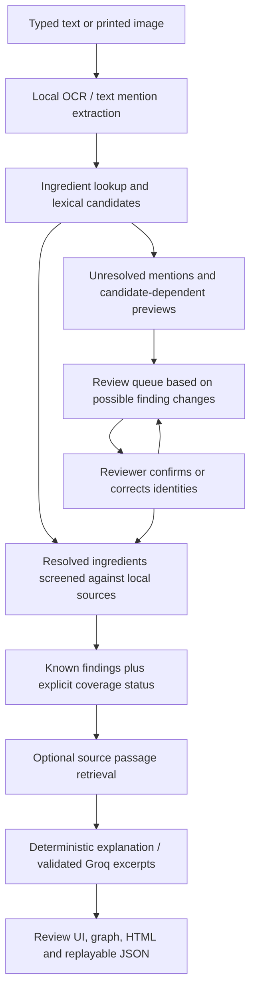

# Implementation brief for the paper team

Prepared on 2026-10-04. This describes software that is implemented and the experiments actually executed. Use it with [the study protocol](RESEARCH_PROTOCOL.md), [paper handoff](PAPER_HANDOFF.md), and [verification record](VERIFICATION_RESULTS.md).

The subsequent hybrid upgrade has a separate [from-scratch explanation and teacher demonstration](HYBRID_ENGINE.md), [T0–T11 checklist](HYBRID_TASK_CHECKLIST.md), and [methods/results draft](HYBRID_PAPER_DRAFT.md). Those documents cover automatic candidate propagation, molecular/GraphSAGE models, biological paths and evaluated model rationale. The original results below retain their historical scope; new experiments do not imply completed human studies.

Update: the local [typed evidence graph](EVIDENCE_GRAPH.md) is now implemented, including provenance/candidate/review queries, graph-backed explanation evidence retrieval, graph export and before/after comparisons. The latest suite has 53 passing tests. Earlier OCR, review-budget and live Groq results below retain their original execution manifests.

## Project description

The project is a medication interaction screening and review prototype for English typed medication text and printed prescription images. It resolves medication mentions to ingredient identifiers, retrieves known drug–drug records and configured drug–food rules, highlights incomplete assessments, and lets a reviewer correct uncertain identities. Findings carry source provenance and can be exported and reproduced.

The original version already had Streamlit, local interaction lookup, a small curated food-rule set, optional OCR, optional live evidence, a Groq explanation path, a graph, and HTML export. These components were improved rather than all newly invented. The main new research method is a review queue that considers which source interaction findings a medicine-identity correction could change.

## Before and after

| Area | Original behavior | Implemented change |
|---|---|---|
| Ingredient identity | Name strings and a small alias dictionary could disagree with source keys | Stable ingredient IDs, preferred names, reviewed-as-demo aliases, exact matches separated from approximate candidates |
| Aspirin coverage | Aspirin did not reliably reach full-source acetylsalicylic-acid records | Both names resolve to `DDInter20`; regression coverage checks all 654 source pairs involving that ID |
| Medication extraction | Dose-based string cleanup could silently discard a second medicine | Multiple mentions per line, original text/spans retained, dose/route/frequency fields, unexplained text retained for review |
| OCR contract | Adapter expected legacy nested tuples despite PaddleOCR 3.x | Structured 3.x text/score/box handling, preserved reading order, cached local CPU models, model hashes and source-region review |
| Ambiguous identities | No structured correction workflow or candidate-impact ordering | Up to five lexical candidates, explicit unresolved status, manual ingredient correction, exclusion of non-medication text, change history |
| Review ordering | No downstream-impact review method | Recomputed priority based on possible high-severity findings, other findings, coverage changes, and ambiguity |
| Completeness | Recognition and source gaps were not consistently represented | Empty/incomplete/complete-for-entered-medicines status; distinct unassessed, no-record, and unknown-severity states |
| Food matching | Substrings, negation, and repeated entries caused false or duplicate matches | Phrase boundaries, negation/uncertainty handling, rule-level deduplication, explicit consumption states |
| Displayed confidence | Fixed numbers looked like clinical confidence percentages | Removed unsupported clinical confidence values; lexical/OCR scores remain explicitly uncalibrated |
| Evidence attachment | Display-name/capitalization joins could fail | Ingredient-ID joins, pair-relevant label passages, document IDs/versions, retrieval timestamps and excerpt hashes |
| Source disagreements | Full lookup could suppress supplementary curated text | Source severity precedence retained, supplementary evidence attached, disagreements exposed |
| Knowledge graph | A pairwise visualization of existing findings | A typed local provenance graph connecting mentions, candidate interpretations, ingredients, findings, evidence, documents and review changes; source-constrained queries and graph downloads |
| LLM output | Prompt-only free text without source-claim validation | Deterministic default, explicit opt-in, allowlisted normalized payload, strict JSON, exact quote/source/severity checks and fallback |
| Reports | Warnings and provenance were incomplete; original text exported routinely | HTML/JSON with coverage, review history and manifests; original-text opt-in; checksum and same-version offline replay |
| UI and privacy | Basic results display and automatic rerun behavior | Four-step review desk, bbox highlight, evidence refresh, explanation cache, stale-input guard, research workspace and session clearing |
| Evaluation | Eight initial tests and four simple synthetic checks | 53 tests, 11 exact regression cases, controlled OCR runs, review simulation, graph conformance, live Groq experiment, baseline/ablation tables and figures |
| Reproducibility | Mostly minimum package versions, no CI or complete container exclusions | Tested Windows lock, resolved Linux profiles, CI configuration, container exclusions, content-derived preprocessing versions |

The ingredient model supports multiple ingredients and manual correction. A comprehensive regional brand/combination database has not been supplied or validated. The food rules are still a small curated set, not an exhaustive dietary interaction resource.

## How the core works

1. Typed text is segmented using the terminology and attribute rules. Images use pretrained PaddleOCR mobile detection and English recognition on the CPU. Original text, line locations and recognition scores are available for review.
2. Exact known terms and configured aliases resolve to ingredient IDs. Uncertain readings receive lexical suggestions using sequence similarity, including simple OCR-confusable variants. The candidate limit is five and the minimum similarity is 0.60. These are operational settings, not calibrated probability thresholds. OCR scores below 0.90 require review in the evaluated adapter configuration.
3. The engine screens unordered pairs of resolved ingredient IDs against the versioned local source lookup, with curated fallback/supplementary records. Unresolved identities are not guessed into confirmed alerts. Repeated ingredients are flagged. Food entries are checked against configured rules with consumption context.
4. Candidate-dependent previews help order review. Review decisions preserve the observed text and record the chosen IDs, timestamp, and before/after findings. Screening and priority ordering are recomputed after each decision.
5. Optional openFDA retrieval attaches relevant label passages and their specific provenance. PubChem supplies identity information and is excluded from interaction-explanation evidence. Retrieval failure leaves local source findings intact.
6. The application produces a deterministic explanation. If the reviewer explicitly enables Groq, the model selects supplied excerpts. Application validation rejects an altered severity, unknown record/citation, duplicated or missing claim, or quote absent from the cited source text.
7. Exports include normalized IDs, coverage, warnings, history and code/data/configuration hashes. Original text is omitted by default. JSON replay checks integrity and compatible source/software versions before recomputing local findings. Integrity hashes are checksums, not digital signatures.

The local source has 1,939 drug names and 160,235 unique unordered pairs, as recorded in the initial audit. These are source-database counts. The system does not train a new interaction predictor, estimate patient-specific adverse-event probabilities, or discover novel interactions. The typed graph supports provenance and candidate-impact queries, and a separate map visualizes findings. No graph neural network, external biomedical KG, vector database or learned retrieval reranker is implemented.

## Proposed research contribution

Research question: **At the same number of identity-review actions, can downstream interaction-impact ordering recover more source-supported high-severity findings than ordering by recognition/matching uncertainty alone?**

For each unreviewed mention, the system evaluates its candidate ingredient sets with the available interpretations of other mentions. It compares signatures containing ingredient IDs and source states; signatures include the unresolved baseline where applicable. Distinct high-severity pair identities remain distinct even when their severity labels match.

The queue uses this lexicographic priority:

1. No usable candidate: manual identification required.
2. Number of partner entries with candidate-dependent differences involving high-severity findings.
3. Number with differences involving moderate/low findings.
4. Number with differences involving unknown severity, missing source records, or unassessed status.
5. Lexical/OCR ambiguity, then original entry order.

Exact matches remain reviewable but have their interaction-change counters reset to zero. The queue is recomputed after every correction. Importantly, interaction severity changes review order only: candidate generation never uses the number or severity of possible alerts to choose a medicine's identity.

This is an implemented, testable contribution hypothesis. Engineering fixes such as stable IDs, better OCR parsing, source tracking, or combining an LLM with a lookup are supporting features. A claim of unprecedented novelty or superiority over published systems requires further related-work analysis and independent evaluation.

## Implemented study design

The review experiment compares seven methods: frozen original engine, corrected engine without review, prescription order, uncertainty order, proposed impact order, impact without severity precedence, and a gold-corrected upper bound. Budgets are 0%, 25%, 50%, 75%, and 100% of entered items, rounded upward. All ordering methods share the same no-candidate-first policy, terminology, candidate generation, sources, and inputs.

The default dataset contains 40 synthetic prescription groups with clean, single-character-error, and mixed-corruption variants: 120 cases total. Eight groups are development and 32 are test, giving 96 test cases. Medication-entry boundaries are provided. Gold corrections are revealed to the simulated reviewer only after the next review item has been selected. This experiment evaluates identity resolution and review ordering; it is not whole-document OCR evaluation or human review time measurement.

Outputs include identity accuracy, candidate recall, source-finding precision/recall/F1, high-severity finding recovery, review counts, failure categories, source-severity confusion, latency, budget curves, and a severity ablation. Missing source records are not treated as evidence of safe combinations.

There is also a separate eight-image controlled OCR experiment from two base prescriptions, and a separate explanation experiment with template, prompt-only, and validated-excerpt methods. Expert claim-support/citation scores remain empty until actual reviewers complete the rating sheets.

## Executed results and their scope

| Experiment | Observed result | Allowed interpretation |
|---|---|---|
| Automated suite | 53 tests passed | Tested software behavior, graph constraints and regressions |
| Exact fixture evaluation | 11/11 passed | Agreement with the configured source fixtures |
| OCR image experiment | 8 images from 2 base groups; no failures; CER/WER 0 and ingredient/finding recall 1 | Controlled printed-image integration only |
| Proposed review method | 14.29 percentage-point improvement in high-severity source-finding recall over uncertainty order at a 50% simulated budget on corrupted text | Preliminary source-derived synthetic result |
| Paired bootstrap | 95% interval: 6.25–23.34 percentage points; 1,000 paired prescription-group resamples, seed 17 | Uncertainty estimate within this dataset/design |
| Live explanations | 4/4 extractive outputs passed; 12 outputs total across three methods | API integration and source-contract conformance |

Software tests and synthetic checks cannot be described as 100% clinical accuracy. Exact-quote checks constrain model output but do not prove that a passage clinically supports a finding. Real photographs, handwritten challenges, independent expert labels, and human usability/time measurements are pending.

## Groq free-account configuration

The owner reports using Groq's Free tier. The configured model is `openai/gpt-oss-20b`, with low reasoning effort, strict JSON output and a 1,600-token completion cap. The core screening, review method, OCR and default explanations run without Groq.

As checked on 2026-10-04, Groq publishes the following Free-tier limits for this model: 30 requests/minute, 1,000 requests/day, 8,000 tokens/minute, and 200,000 tokens/day. Limits are organization-wide and account exceptions exist; the organization's [Limits page](https://console.groq.com/settings/limits) is authoritative. Exceeding a limit returns HTTP 429. The app uses bounded requests and caching, and returns its deterministic explanation if the external request fails. Several concurrent reviewers can still exceed a shared token limit. See [Groq rate limits](https://console.groq.com/docs/rate-limits).

The recorded `$0.00051315` is a theoretical estimate for eight requests using published standard paid token prices, not a bill or proof of money spent. The application does not inspect account billing or upgrade the plan. Groq's documentation describes usage billing after upgrading to Developer tier and cessation of usage charges on the Free tier. See [billing documentation](https://console.groq.com/docs/billing-faqs). No paid upgrade is needed for the already-tested model workflow, provided the account retains access and available quota.

For demonstrations, use deterministic mode while typing/reviewing and enable Groq once the dossier is ready. If quota is exhausted, continue with deterministic output; wait for the quota to reset before retrying external output. The UI checkbox can be switched off and on after waiting. The input and source evidence remain available.

## Suggested manuscript wording

> We implemented a medication interaction screening workflow that preserves prescription text and OCR regions, resolves mentions to stable ingredient identifiers, and exposes unresolved identities for review. Candidate identities are proposed independently of interaction results. A downstream-impact ordering method then prioritizes review based on candidate-dependent changes to source interaction findings and recomputes the queue after each correction. Known findings are linked to versioned sources, and optional language-model output is restricted to supplied excerpts with structural and source checks. Grouped synthetic experiments compare ordering methods under fixed review budgets; independent expert-reviewed prescription evaluation remains pending.

Use this as methods wording, not as a substitute for completing the study. Paper teammates can write the architecture, algorithms, synthetic experiment, and limitations now. Complete the expert dataset, freeze the test split, run the independent evaluation, collect explanation ratings, inspect the UI on real devices, and verify the container before stronger effectiveness claims or a final release. Existing images require permission and de-identification before sharing.

The shared results and figures are under [the archived synthetic checkpoint](research_artifacts/checkpoint_2026-10-04/). Preserve every experiment's original manifest; the synthetic review run predates the later Groq migration.
